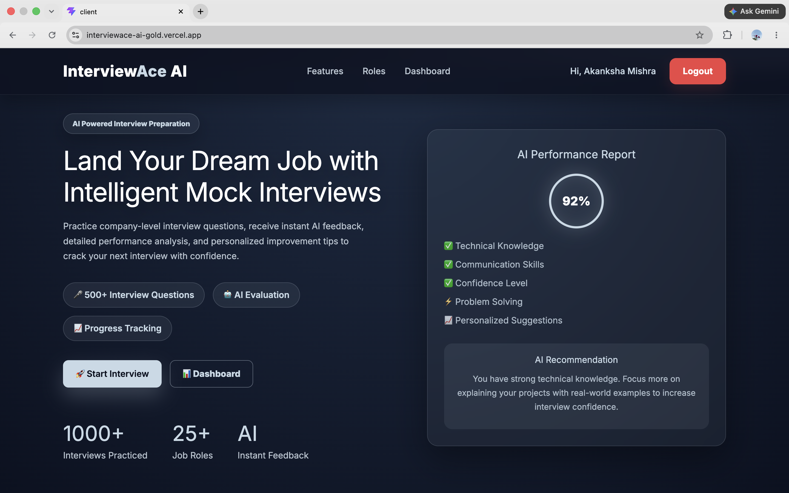
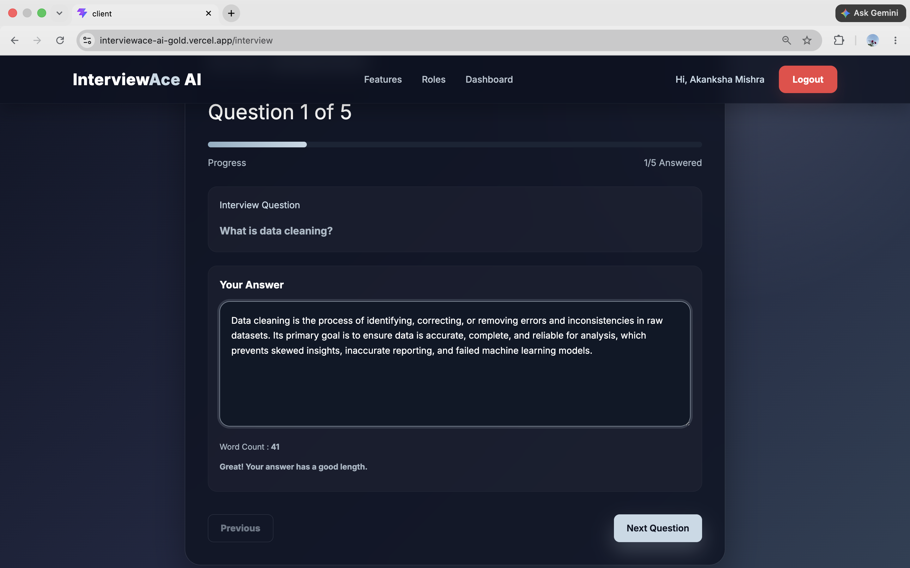
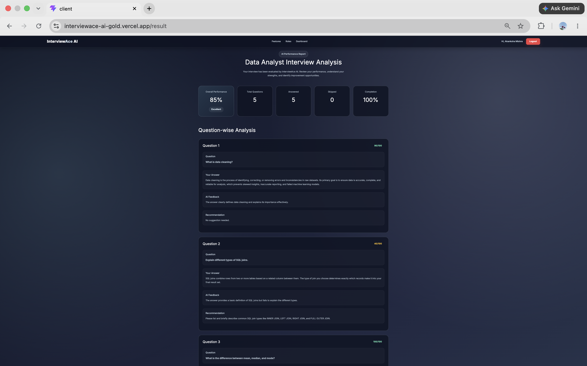
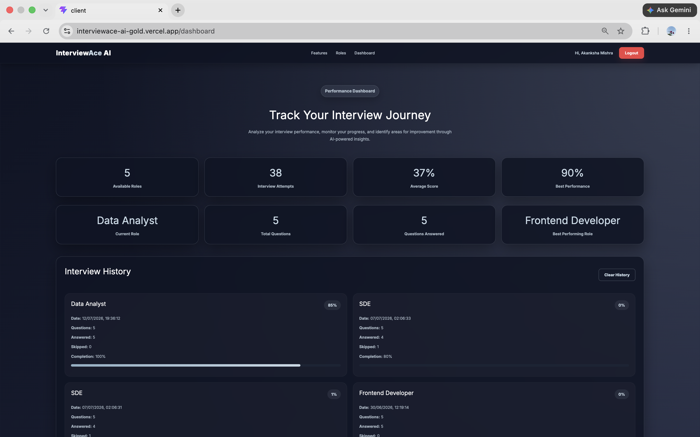
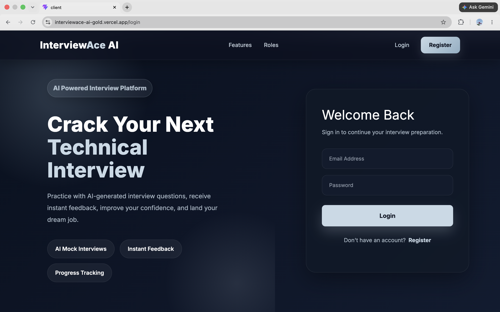
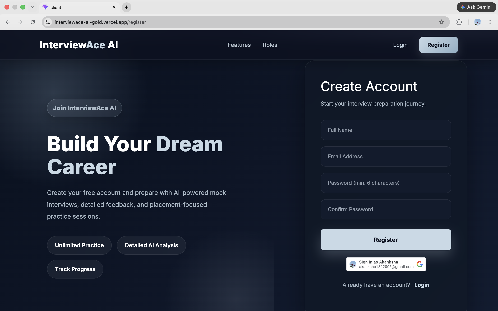

# 🚀 InterviewAce AI

<div align="center">

### AI-Powered Mock Interview Preparation Platform

Practice role-based interviews, receive AI-generated feedback, improve your communication skills, and track your interview performance—all in one platform.

🌐 **Live Demo:** https://interviewace-ai-gold.vercel.app

</div>

---

## 📖 About the Project

InterviewAce AI is a full-stack web application designed to help students and job seekers prepare for technical and HR interviews through realistic mock interview sessions.

Users can choose an interview role, answer role-specific questions, receive AI-generated feedback using **Google Gemini AI**, view detailed performance reports, and monitor their progress through a personalized dashboard.

The platform also includes secure user authentication with email/password and Google Sign-In, ensuring every user's interview history remains private.

---

## ✨ Features

### 👨‍💻 Mock Interview System

- Role-based interview preparation
- Multiple interview roles
- Dynamic interview questions
- Answer writing interface
- Word count validation
- Previous & Next question navigation
- Interview completion tracking

### 🤖 AI Evaluation

- Google Gemini AI Integration
- AI-generated answer feedback
- Question-wise evaluation
- Improvement suggestions
- Overall interview score
- Personalized performance report

### 🔐 Authentication

- User Registration
- Secure Login
- Logout
- Google Sign-In
- JWT Authentication
- Protected Routes
- Persistent Login Session

### 📊 Dashboard

- Interview history
- Average score
- Best score
- Best interview role
- Current preparation progress
- Clear interview history

### 🎨 User Experience

- Responsive UI
- Modern interface
- Smooth navigation
- Mobile-friendly design

---

# 🛠 Tech Stack

## Frontend

- React.js
- Vite
- React Router DOM
- CSS3
- Axios

## Backend

- Node.js
- Express.js
- MongoDB
- Mongoose
- JWT Authentication
- Google Gemini API

## Deployment

- Frontend → Vercel
- Backend → Render
- Database → MongoDB Atlas

---

# 📂 Project Structure

```text
InterviewAce-AI
│
├── client
│   ├── src
│   │   ├── api
│   │   │   ├── authApi.js
│   │   │   └── interviewApi.js
│   │   │
│   │   ├── components
│   │   │   ├── Navbar
│   │   │   ├── Hero
│   │   │   ├── Features
│   │   │   ├── RoleSelection
│   │   │   ├── InterviewScreen
│   │   │   ├── ResultPage
│   │   │   ├── Dashboard
│   │   │   ├── Footer
│   │   │   └── ProtectedRoute
│   │   │
│   │   ├── context
│   │   │   └── AuthContext
│   │   │
│   │   ├── pages
│   │   │   ├── Login
│   │   │   └── Register
│   │   │
│   │   ├── data
│   │   ├── assets
│   │   ├── App.jsx
│   │   └── main.jsx
│   │
│   └── package.json
│
├── server
│   ├── config
│   ├── controllers
│   ├── middleware
│   ├── models
│   ├── routes
│   ├── utils
│   ├── server.js
│   └── package.json
│
└── README.md
```

---

# 🤖 AI Integration

InterviewAce AI uses **Google Gemini AI** to evaluate interview answers.

For every submitted interview, Gemini generates:

- Question-wise score
- Personalized feedback
- Improvement suggestions
- Overall interview score

This helps users understand their strengths and identify areas for improvement.

---

# 🔐 Authentication

The application includes a complete authentication system:

- Email Registration
- Email Login
- Google Sign-In
- JWT Authentication
- Protected Dashboard
- User Session Persistence

---

# 📡 API Endpoints

## Authentication

| Method | Endpoint | Description |
|---------|----------|-------------|
| POST | `/api/auth/register` | Register User |
| POST | `/api/auth/login` | Login User |
| POST | `/api/auth/google` | Google Login |

## Interview

| Method | Endpoint | Description |
|---------|----------|-------------|
| GET | `/api/interviews` | Fetch Interview History |
| POST | `/api/interviews` | Save Interview |
| DELETE | `/api/interviews` | Clear Interview History |

---

# ⚙️ Installation

## Clone Repository

```bash
git clone https://github.com/akanksha-mishra13/interviewace-ai.git

cd interviewace-ai
```

---

## Backend Setup

```bash
cd server

npm install
```

Create `.env`

```env
PORT=5001

MONGO_URI=your_mongodb_connection_string

JWT_SECRET=your_secret_key

GEMINI_API_KEY=your_gemini_api_key

CLIENT_URL=http://localhost:5173
```

Run Backend

```bash
npm run dev
```

---

## Frontend Setup

```bash
cd client

npm install
```

Create `.env`

```env
VITE_API_BASE_URL=http://localhost:5001/api
```

Run Frontend

```bash
npm run dev
```

---

# 🌍 Deployment

### Frontend

https://interviewace-ai-gold.vercel.app

### Backend

https://interviewace-ai-backend-76df.onrender.com

---

# 📸 Screenshots

## Home Page



## Interview Page



## Result Page



## Dashboard



## Login



## Register



---

# 🚀 Future Enhancements

- 🎙 Voice-based Interview Practice
- 🎥 Video Interview Mode
- 📄 Resume Analysis
- 💻 Coding Interview Round
- 📊 Performance Graphs
- 🏢 Company-specific Interview Sets
- 🧠 Adaptive AI Question Generation
- 🏆 Achievement Badges & Certificates

---

# 👩‍💻 Author

**Akanksha Mishra**

B.Tech Computer Science & Engineering

🔗 GitHub: https://github.com/akanksha-mishra13

🌐 Frontend: https://interviewace-ai-gold.vercel.app

⚙️ Backend: https://interviewace-ai-backend-76df.onrender.com

---

## ⭐ Support

If you found this project helpful, consider giving it a **⭐ Star** on GitHub.